# Architecture Design: LAN Low-Latency Remote Desktop SDK

**Document Version**: 2.0 (UML 2.0 Standard)  
**Date**: 2025-02-11  
**Feature**: 1-lan-remote-desktop  
**Status**: Draft  
**UML Version**: 2.0

## Table of Contents

1. [Technical Solution Overview](#technical-solution-overview)
2. [System Architecture Diagrams](#system-architecture-diagrams)
3. [Layered Architecture](#layered-architecture)
4. [Module Design](#module-design)
5. [Interface Diagrams](#interface-diagrams)
6. [Sequence Diagrams](#sequence-diagrams)
7. [Activity Diagrams](#activity-diagrams)
8. [Component Diagrams](#component-diagrams)
9. [Deployment Diagrams](#deployment-diagrams)
10. [Package Diagrams](#package-diagrams)

---

## Technical Solution Overview

### 1.1 Technical Architecture

The Remote Desktop SDK implements a **Clean Architecture** pattern with five layers, ensuring separation of concerns and testability.

#### Key Technologies

| Component | Technology | Purpose |
|------------|------------|---------|
| Server Language | C++20 | High-performance native implementation |
| Client Language | JavaScript ES2020 | Chrome browser compatibility |
| Video Transport | WebRTC (libwebrtc) | Low-latency real-time streaming |
| Screen Capture | DXGI Desktop Duplication API | Hardware-accelerated capture |
| Video Encoding | H.264 (NVENC/QuickSync/x264) | Efficient video compression |
| Signaling | WebSocket | SDP exchange and ICE negotiation |
| Build System | CMake | Cross-platform build configuration |
| Testing | Google Test (C++), Jest (JS) | Comprehensive test coverage |

#### Performance Targets

| Metric | Target | Method |
|--------|--------|--------|
| End-to-end latency | ≤30ms | Optimized pipeline, lock-free queues |
| Video frame rate | 60fps | Hardware encoding, minimal buffering |
| CPU usage | <30% (idle) | Hardware acceleration |
| Memory usage | <200MB (idle) | Object pooling, shared_ptr |
| Network bandwidth | 5-15Mbps @1080p@60fps | Adaptive bitrate |
| Display switch time | <100ms | Hot-switch, minimal disruption |
| Max concurrent clients | 4 | Tested and validated |

---

## System Architecture Diagrams

### 2.1 High-Level Architecture Diagram

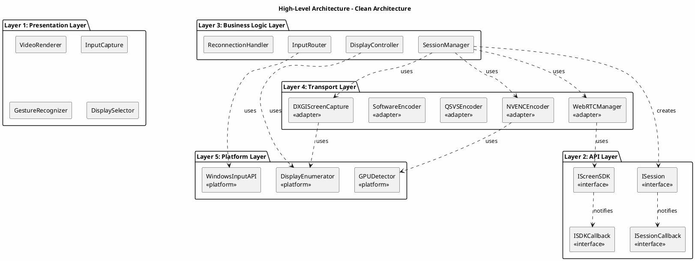

### 2.2 System Context Diagram

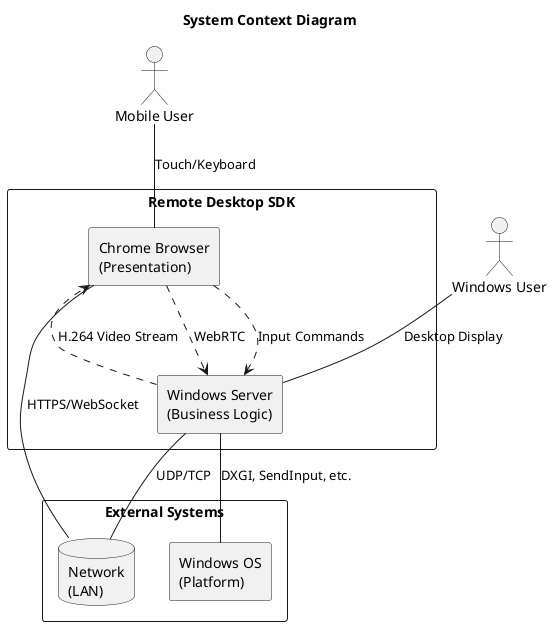

---

## Layered Architecture

### 3.1 Layer Dependency Diagram

```plantuml
@startuml LayerDependency
!define RECTANGLE class
skinparam layerarrowColor #000000

title Layer Dependency Diagram

layer Presentation {
    rectangle "VideoRenderer" as V1
    rectangle "InputCapture" as V2
    rectangle "GestureRecognizer" as V3
}

layer API {
    rectangle "IScreenSDK" as A1
    rectangle "ISession" as A2
    rectangle "Configuration" as A3
}

layer BusinessLogic {
    rectangle "SessionManager" as B1
    rectangle "InputRouter" as B2
    rectangle "DisplayController" as B3
}

layer Transport {
    rectangle "IScreenCapture" as T1
    rectangle "IVideoEncoder" as T2
    rectangle "IWebRTCManager" as T3
}

layer Platform {
    rectangle "DXGIScreenCapture" as P1
    rectangle "NVENCEncoder" as P2
    rectangle "WebRTCManager" as P3
}

V1 ..> A1 : depends on
V2 ..> A2 : depends on
A1 ..> B1 : depends on
A2 ..> B2 : depends on
B1 ..> T1 : depends on
B1 ..> T2 : depends on
B2 ..> T3 : depends on
T1 ..> P1 : implements
T2 ..> P2 : implements
T3 ..> P3 : implements

legend right
  Dependency direction follows Clean Architecture rule
  (outer layer depends on inner layer)
endlegend

@enduml
```

### 3.2 Package Structure Diagram

```plantuml
@startuml PackageStructure
skinparam packageStyle rectangle

title Package Structure

package screensdk {
    
    package "api" {
        class IScreenSDK <<interface>>
        class ISession <<interface>>
        class ISDKCallback <<interface>>
        class ISessionCallback <<interface>>
        class Configuration
        class Result<T>
    }
    
    package "core" {
        class SessionManager
        class Session
        class InputRouter
        class DisplayController
        class ReconnectionHandler
    }
    
    package "capture" {
        class IScreenCapture <<interface>>
        class DXGIScreenCapture
        class CapturePipeline
        class VideoFrame
    }
    
    package "encoding" {
        class IVideoEncoder <<interface>>
        class EncoderFactory
        class NVENCEncoder
        class QSVSEncoder
        class SoftwareEncoder
        class EncoderConfig
    }
    
    package "transport" {
        class IWebRTCManager <<interface>>
        class WebRTCManager
        class IVideoSource <<interface>>
        class CustomVideoTrackSource
        class DataChannel
        class SignalingServer
    }
    
    package "input" {
        class IInputProcessor <<interface>>
        class InputProcessor
        class MouseHandler
        class KeyboardHandler
        class InputMapper
        class GestureHandler
    }
}

package "platform" {
    class WindowsInputAPI
    class DisplayEnumerator
    class GPUDetector
}

' Internal dependencies
SessionManager ..> IScreenCapture
SessionManager ..> IVideoEncoder
SessionManager ..> IWebRTCManager
InputRouter ..> IInputProcessor

@enduml
```

---

## Module Design

### 4.1 API Module Class Diagram

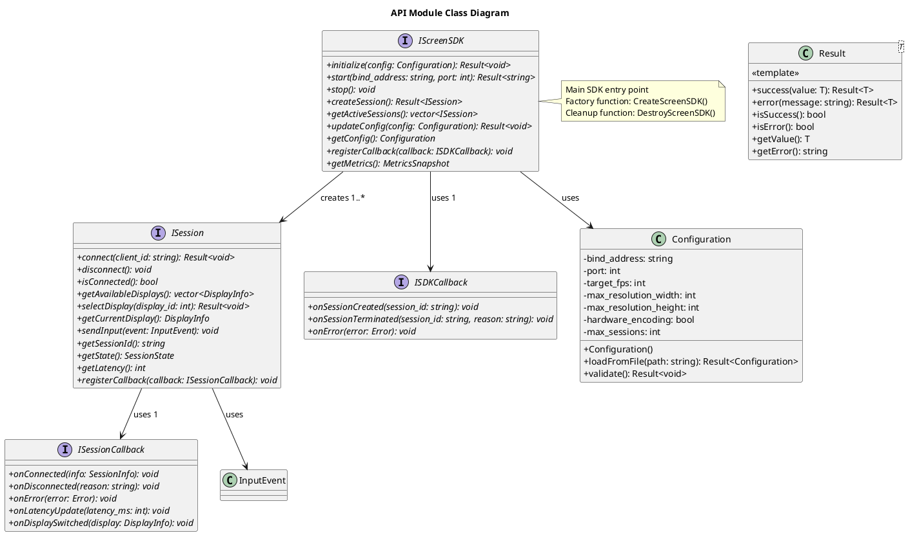

### 4.2 Business Logic Module Class Diagram

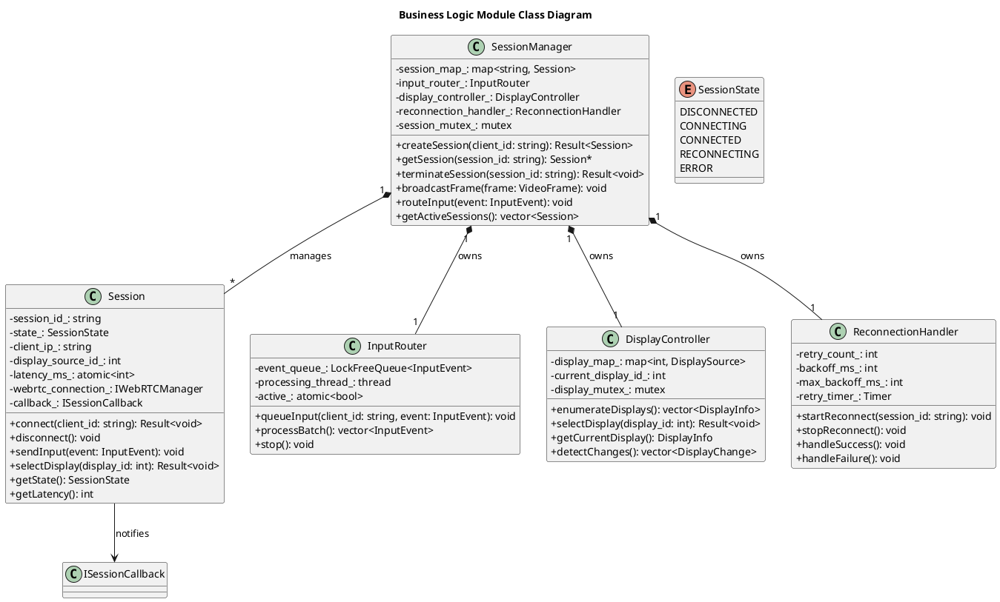

### 4.3 Screen Capture Module Class Diagram

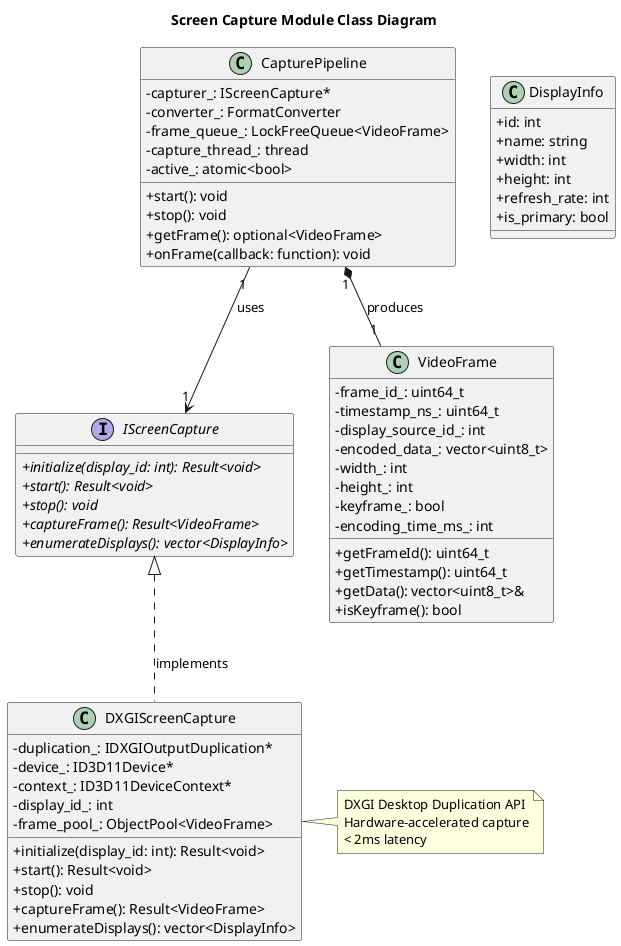

### 4.4 Video Encoding Module Class Diagram

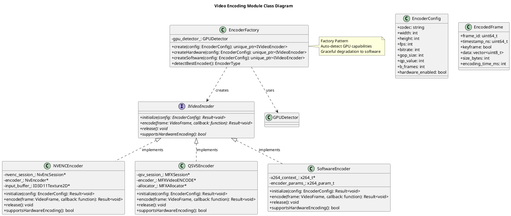

### 4.5 WebRTC Transport Module Class Diagram

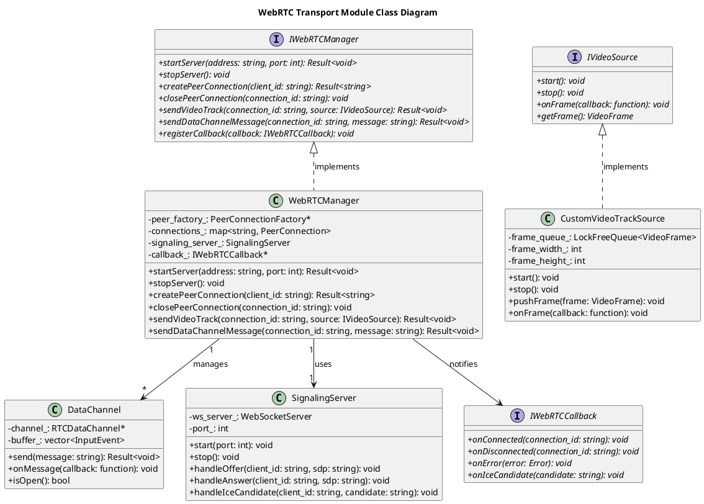

### 4.6 Input Processing Module Class Diagram

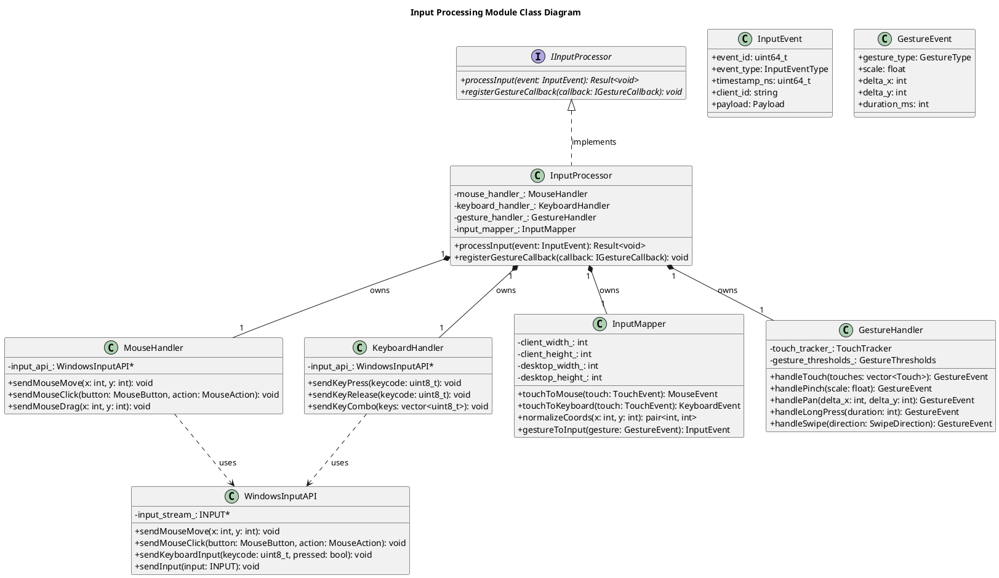

---

## Interface Diagrams

### 5.1 Public Interface Overview

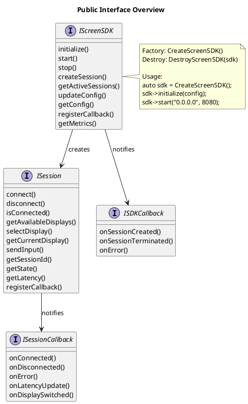

### 5.2 Transport Layer Interfaces

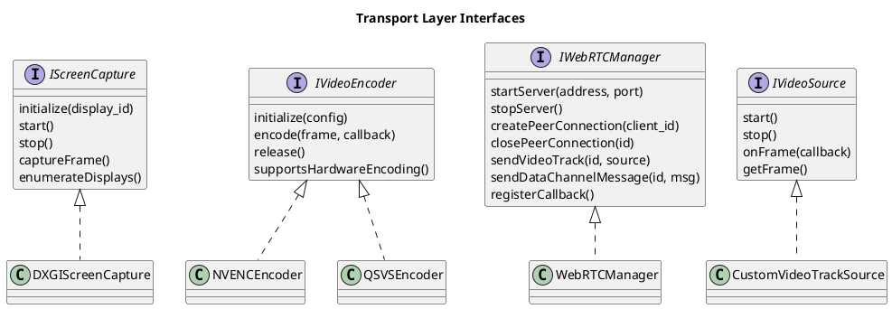

---

## Sequence Diagrams

### 6.1 Session Establishment Sequence Diagram

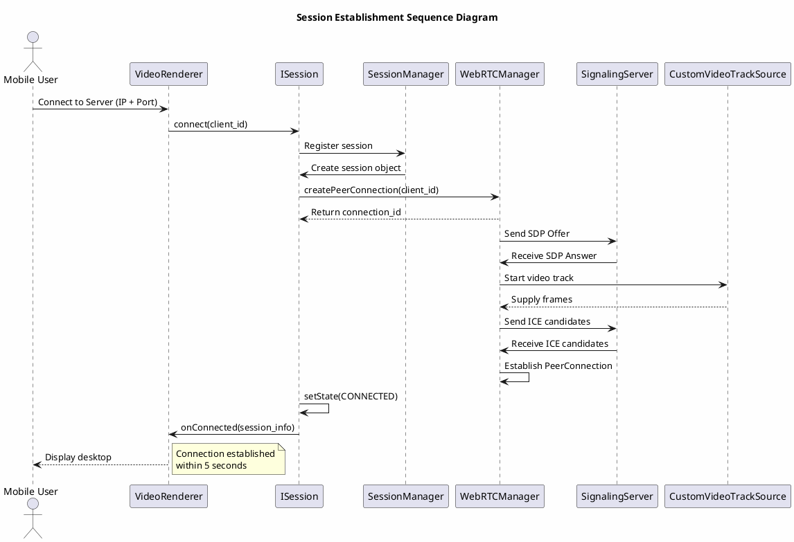

### 6.2 Video Capture and Transmission Sequence Diagram

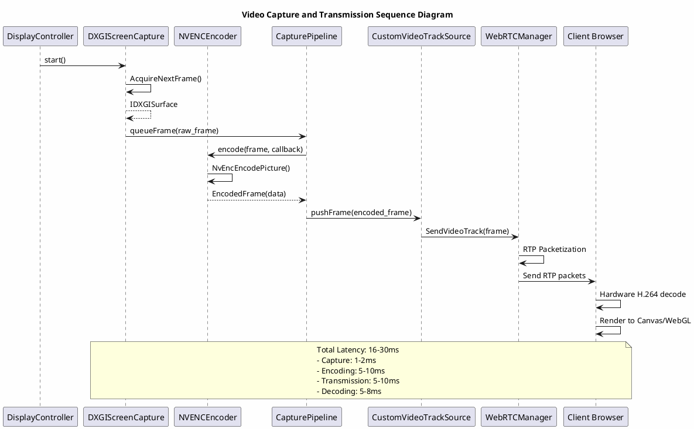

### 6.3 Input Event Processing Sequence Diagram

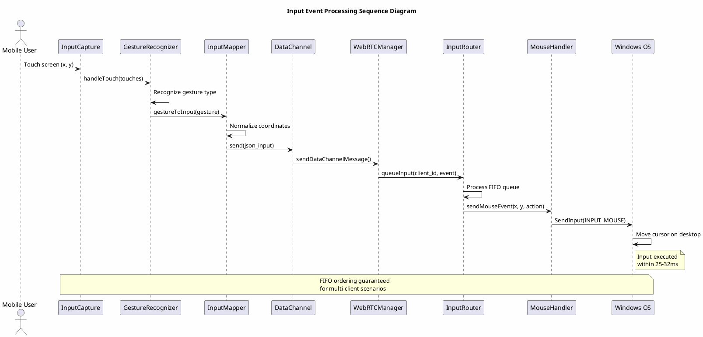

### 6.4 Display Switching Sequence Diagram

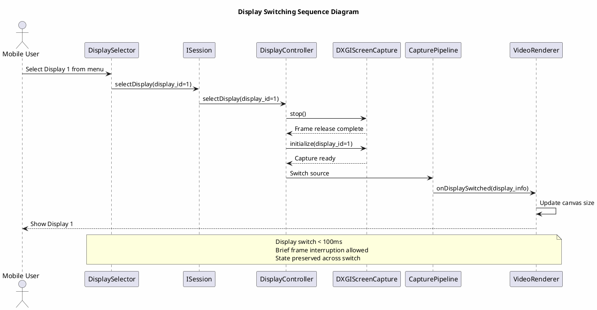

### 6.5 Reconnection Sequence Diagram

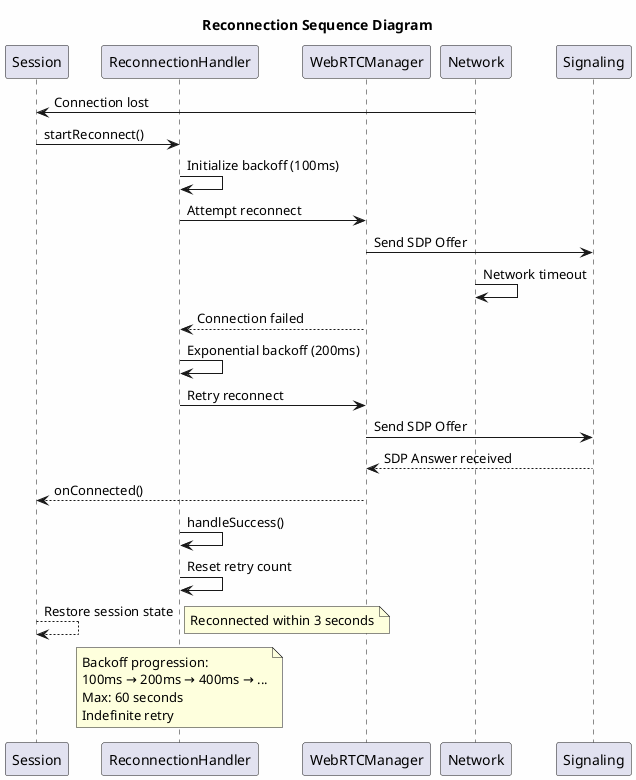

---

## Activity Diagrams

### 7.1 SDK Initialization Activity Diagram

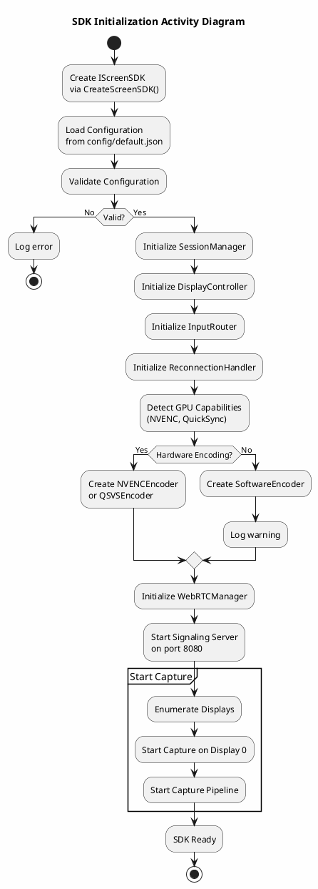

### 7.2 Video Frame Processing Activity Diagram

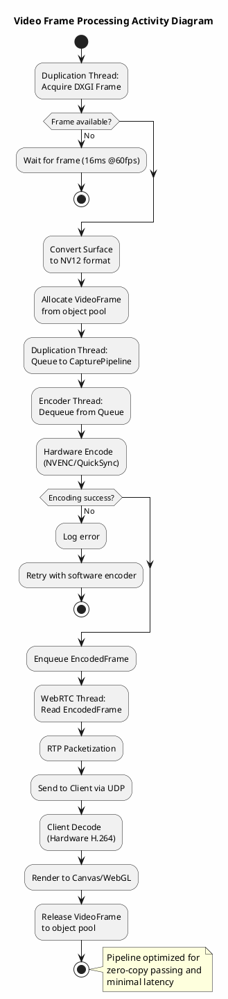

### 7.3 Input Event Handling Activity Diagram

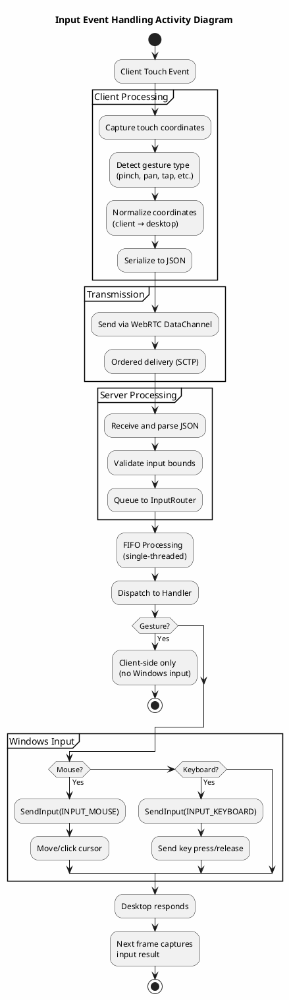

### 7.4 Multi-Client Session Management Activity Diagram

```plantuml
@startuml MultiClientSessionManagement
skinparam backgroundColor #FEFEFE

title Multi-Client Session Management Activity Diagram

start

:Session Manager Started;

while (New client request?) is (Yes)
  :Create Session object;
  :Generate unique session_id;
  :Initialize WebRTC PeerConnection;
  :Subscribe to current display;
  
  if (Max sessions reached?) then (Yes = 4)
    :Reject connection;
    stop
  endif
  
  :Add to session_map_;
  :Notify callback\nonSessionCreated();
  :Wait for WebRTC handshake;
  
  if (Connection successful?) then (Yes)
    :Set session state CONNECTED;
    :Start video stream;
  else (No)
    :Cleanup failed session;
    :Notify callback onError();
  endif
  
  :Client connected;
endwhile (No)

while (Client disconnects?) is (Yes)
  :Remove from session_map_;
  :Close PeerConnection;
  :Cleanup resources;
  :Notify callback\nonSessionTerminated();
endwhile (No)

stop

note right
  Max 4 concurrent clients
  FIFO input ordering
  Shared display source
end note

@enduml
```

---

## Component Diagrams

### 8.1 Server Component Diagram

```plantuml
@startuml ServerComponent
skinparam componentStyle uml2

title Server Component Diagram

component "IScreenSDK" as sdk {
    port "initialize()" as p1
    port "start()" as p2
    port "createSession()" as p3
}

component "SessionManager" as sm {
    port "routeInput()" as p4
    port "broadcastFrame()" as p5
}

component "DisplayController" as dc {
    port "selectDisplay()" as p6
    port "enumerateDisplays()" as p7
}

component "InputRouter" as ir {
    port "processBatch()" as p8
}

component "CapturePipeline" as cp {
    port "getFrame()" as p9
}

component "WebRTCManager" as wm {
    port "sendVideoTrack()" as p10
    port "sendDataChannel()" as p11
}

component "SignalingServer" as ss {
    port "handleOffer()" as p12
    port "handleAnswer()" as p13
}

component "DXGIScreenCapture" as dxc
component "NVENCEncoder" as nvenc
component "WindowsInputAPI" as winapi

' Connectors
sdk ..> sm : creates
sdk ..> dc : creates
sdk ..> ir : creates
sm ..> cp : uses
sm ..> wm : uses
sm ..> winapi : uses
ir ..> winapi : uses
cp ..> dxc : uses
cp ..> nvenc : uses
wm ..> ss : manages
wm --> wm : WebRTC
wm --> wm : H.264 Stream
wm --> wm : Input Commands

@enduml
```

### 8.2 Client Component Diagram

```plantuml
@startuml ClientComponent
skinparam componentStyle uml2

title Client Component Diagram

component "RemoteDesktopClient" as client {
    port "connect()" as c1
    port "disconnect()" as c2
}

component "VideoRenderer" as vr {
    port "onFrame()" as v1
    port "onDisplaySwitched()" as v2
}

component "InputCapture" as ic {
    port "onTouch()" as i1
    port "onKeyPress()" as i2
}

component "GestureRecognizer" as gr {
    port "recognize()" as g1
}

component "ViewController" as vc {
    port "zoom()" as vc1
    port "pan()" as vc2
}

component "DisplaySelector" as ds {
    port "onSelect()" as d1
}

component "MetricsDisplay" as md {
    port "updateMetrics()" as m1
}

component "WebRTCConnection" as wc {
    port "sendVideoOffer()" as w1
    port "sendInputMessage()" as w2
}

' Connectors
client ..> vr : creates
client ..> ic : creates
client ..> wc : creates
client ..> gr : uses
client ..> vc : uses
client ..> ds : uses
client ..> md : uses
ic ..> gr : delegates
wc ..> vr : delivers frames
wc ..> ds : delivers display list
vr --> wc : subscribe video
ic --> wc : send input

@enduml
```

---

## Deployment Diagrams

### 9.1 Network Deployment Diagram

```plantuml
@startuml NetworkDeployment
skinparam componentStyle uml2

title Network Deployment Diagram

node "Windows Host\n(192.168.1.100)" as server {
    component "screensdk_server.exe" as svr
    component "screensdk.dll" as dll
    component "Configuration\nconfig.json" as cfg
    component "Logs\nlogs/" as logs
    artifact "DXGI API" as dxgi
    artifact "NVENC SDK" as nvenc
}

node "Router" as router
node "Switch" as sw

node "Mobile Client 1\n(192.168.1.101)" as client1 {
    component "Chrome Browser" as ch1
}

node "Mobile Client 2\n(192.168.1.102)" as client2 {
    component "Chrome Browser" as ch2
}

node "Mobile Client 3\n(192.168.1.103)" as client3 {
    component "Chrome Browser" as ch3
}

' Connections
svr -- router : TCP 8080 (Signaling)
svr -- router : UDP 50000-59999 (Media)
client1 -- router : Wi-Fi/4G
client2 -- router : Wi-Fi/4G
client3 -- router : Wi-Fi/4G
router -- sw : LAN
sw -- router : LAN

svr --> dll : loads
svr --> cfg : reads
svr --> logs : writes
svr -dxgi : uses
svr -nvenc : uses

ch1 -[hidden]down- svr : WebRTC
ch2 -[hidden]down- svr : WebRTC
ch3 -[hidden]down- svr : WebRTC

@enduml
```

### 9.2 Hardware Deployment Diagram

```plantuml
@startuml HardwareDeployment
skinparam componentStyle uml2

title Hardware Deployment Diagram

node "Windows PC" as pc {
    artifact "CPU\nIntel i5/AMD Ryzen 5" as cpu
    artifact "GPU\nNVIDIA GTX 1650\nor Intel Arc A380" as gpu
    artifact "RAM\n8GB" as ram
    artifact "Network\nGigabit LAN" as net
    
    component "Remote Desktop SDK" as sdk
    component "WebRTC Library" as webrtc
    component "GPU Drivers" as drivers
}

node "Displays" as displays {
    node "Display 0\n1920x1080@60Hz" as disp0
    node "Display 1\n1920x1080@60Hz" as disp1
}

node "Mobile Devices" as mobile {
    device "Phone 1\nChrome Mobile" as phone1
    device "Tablet 1\nChrome Mobile" as tablet1
}

' Connections
sdk -cpu : runs on
sdk -gpu : hardware encode
sdk -ram : uses
sdk -net : binds to
sdk -webrtc : integrates
sdk -drivers : DX11, NVENC
disp0 -gpu : connected to
disp1 -gpu : connected to
mobile -net : Wi-Fi connection

note right of gpu
  Required for
  H.264 hardware encoding
  (5-10ms latency)
  
  Fallback: Software encoding
  (15-20ms latency)
end note

@enduml
```

---

## Package Diagrams

### 10.1 Complete Package Dependency Diagram

```plantuml
@startuml PackageDependency
skinparam packageStyle rectangle

title Package Dependency Diagram

package "screensdk" {
    
    package "api" as api {
        interface IScreenSDK
        interface ISession
        interface ISDKCallback
        interface ISessionCallback
        class Configuration
        class Result<T>
    }
    
    package "core" as core {
        class SessionManager
        class Session
        class InputRouter
        class DisplayController
        class ReconnectionHandler
    }
    
    package "capture" as cap {
        interface IScreenCapture
        class DXGIScreenCapture
        class CapturePipeline
        class VideoFrame
    }
    
    package "encoding" as enc {
        interface IVideoEncoder
        class EncoderFactory
        class NVENCEncoder
        class QSVSEncoder
        class SoftwareEncoder
    }
    
    package "transport" as trans {
        interface IWebRTCManager
        interface IVideoSource
        class WebRTCManager
        class CustomVideoTrackSource
        class DataChannel
    }
    
    package "input" as inp {
        interface IInputProcessor
        class InputProcessor
        class MouseHandler
        class KeyboardHandler
        class GestureHandler
    }
}

package "platform" as plat {
    class WindowsInputAPI
    class DisplayEnumerator
    class GPUDetector
}

package "presentation" as pres {
    class VideoRenderer
    class InputCapture
    class GestureRecognizer
    class DisplaySelector
}

' Dependencies
pres ..> api : depends
api ..> core : depends
core ..> cap : depends
core ..> enc : depends
core ..> trans : depends
core ..> inp : depends
cap ..> plat : depends
enc ..> plat : depends
trans ..> plat : depends
inp ..> plat : depends

note right
  Dependency Rule:
  Outer layers depend on inner layers
  Inner layers have no dependencies
  on outer layers
end note

@enduml
```

### 10.2 Module Interaction Diagram

```plantuml
@startuml ModuleInteraction
skinparam packageStyle rectangle

title Module Interaction Diagram

rectangle "API Layer" {
    component "IScreenSDK" as isdk
    component "ISession" as isession
}

rectangle "Business Logic" {
    component "SessionManager" as sm
    component "InputRouter" as ir
    component "DisplayController" as dc
}

rectangle "Transport" {
    component "CapturePipeline" as cp
    component "WebRTCManager" as wm
}

rectangle "Platform" {
    component "DXGIScreenCapture" as dxc
    component "WindowsInputAPI" as wia
}

' Interactions
isdk -> sm : createSession()
isession -> sm : connect()
sm -> dc : selectDisplay()
sm -> ir : routeInput()
ir -> wia : sendMouseMove()
sm -> wm : createPeerConnection()
wm -> sm : onConnected()
sm -> cp : getFrame()
cp -> dxc : captureFrame()

note right of sm
  Central orchestrator
  Coordinates all modules
  Maintains session state
end note

@enduml
```

---

## Appendix: UML 2.0 Notation Reference

### Notation Legend

| Symbol | Meaning |
|---------|---------|
| `interface` | Interface/Abstract class |
| `class` | Concrete class |
| `<<interface>>` | Stereotype for interface |
| `<<factory>>` | Factory pattern |
| `<<adapter>>` | Adapter pattern |
| `<<template>>` | Generic/template class |
| `-->` | Association |
| `..>` | Dependency |
| `*--` | Composition |
| `o--` | Aggregation |
| `<|--` | Inheritance/Implementation |
| `+` | Public member |
| `-` | Private member |
| `#` | Protected member |

### Relationship Types

```
Inheritance:        Subclass <|-- Superclass
Implementation:     Class <|.. Interface
Association:        ClassA --> ClassB
Dependency:         ClassA ..> ClassB
Composition:        Container *-- Component
Aggregation:        Container o-- Component
Realization:        Interface <|.. Implementation
```

---

**End of Document**
